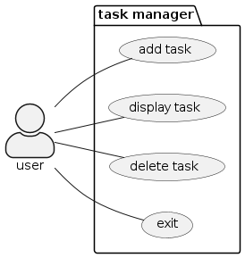

# To-do (user doc)

This document will guide you through using the application to manage your tasks efficiently.

## Overview
The Task Manager Application is a simple tool designed to help you organize your tasks into three categories: Inbox, Today, and Tomorrow. You can add tasks, delete tasks, and display your task lists with ease.

## Getting Started
To begin using the Task Manager Application, follow these steps:

* Run the application in your preferred Python environment.
* Follow the prompts displayed on the screen to navigate through the menu options.

### Menu Options
The Task Manager Application provides the following menu options:

* Add New Task: Allows you to add a new task to one of the task lists (Inbox, Today, or Tomorrow).
* Delete Task: Enables you to delete a task from the task list.
* Display Task List: Displays the tasks in the selected task list (Inbox, Today, or Tomorrow).
* Exit: Exits the Task Manager Application.

#### Adding a New Task
To add a new task to the task list, follow these steps:

* Choose the "Add New Task" option from the main menu.
* Enter the task you want to add when prompted.
* Select the list where you want to add the task (Inbox, Today, or Tomorrow).
* Confirm the addition of the task.

#### Deleting a Task
To delete a task from the task list, follow these steps:

* Choose the "Delete Task" option from the main menu.
* Follow the prompts to select the task you want to delete.
* Confirm the deletion of the task.

#### Displaying Task Lists
To display the tasks in a specific task list, follow these steps:

* Choose the "Display Task List" option from the main menu.
* Select the task list you want to display (Inbox, Today, or Tomorrow).
* View the tasks listed in the selected task list.

#### Exiting the Application
To exit the Task Manager Application, choose the "Exit" option from the main menu. This will close the application.

## Additional Notes
Ensure to input valid options and follow the prompts provided by the application to prevent errors.
Take advantage of the task categorization (Inbox, Today, Tomorrow) to prioritize and manage your tasks effectively.

### Simplified representation down bellow:

 

  

